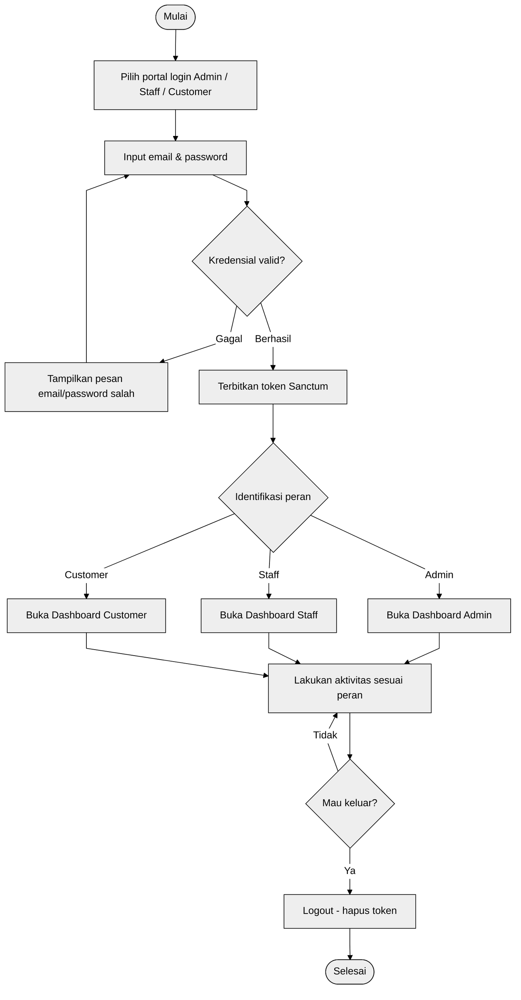
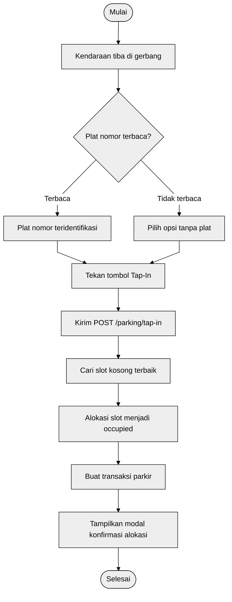
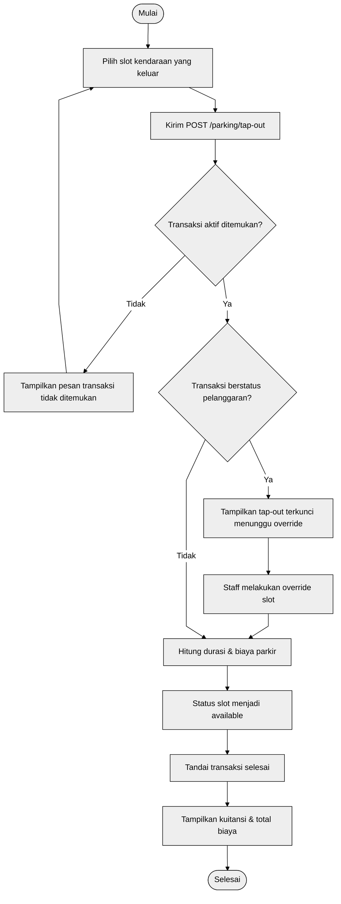
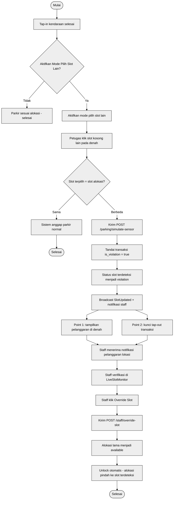
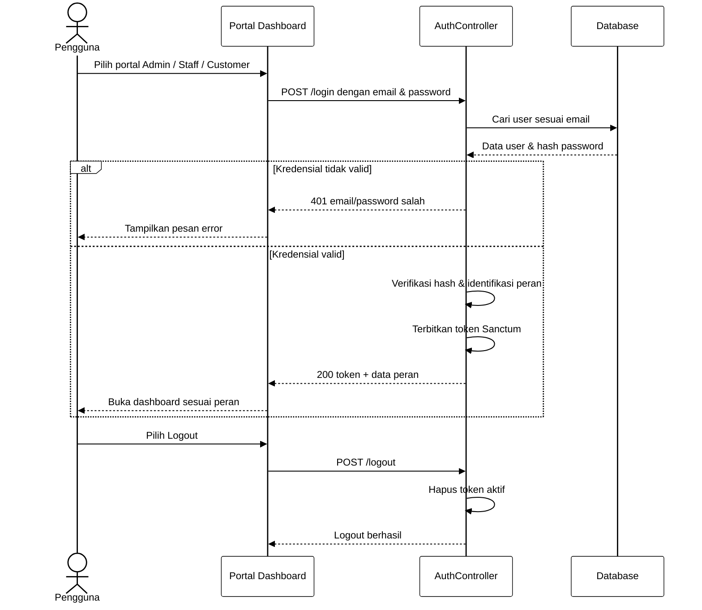
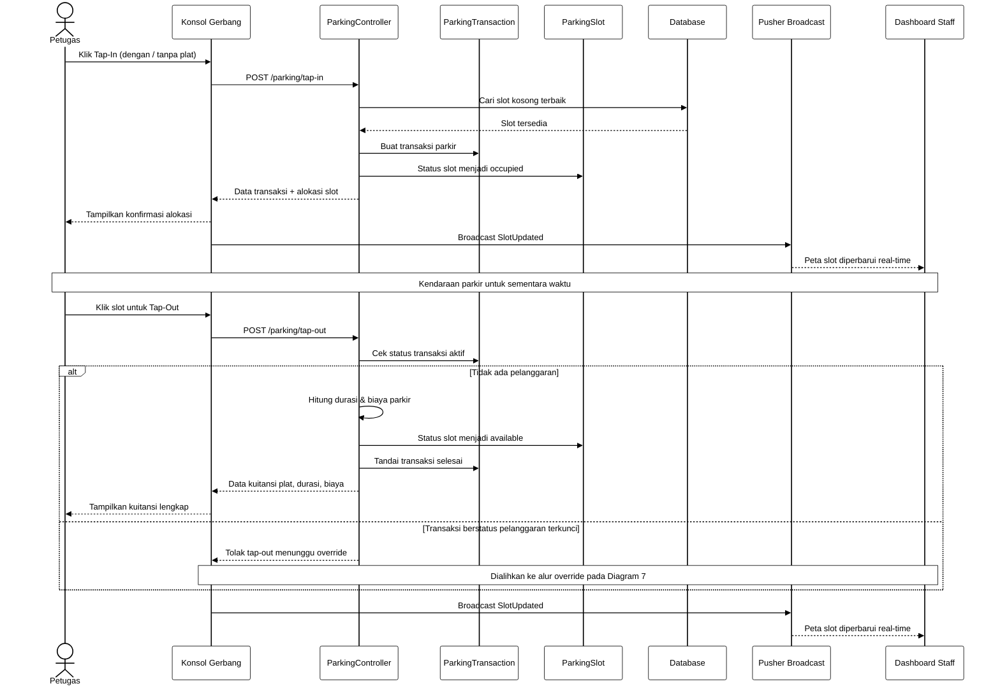
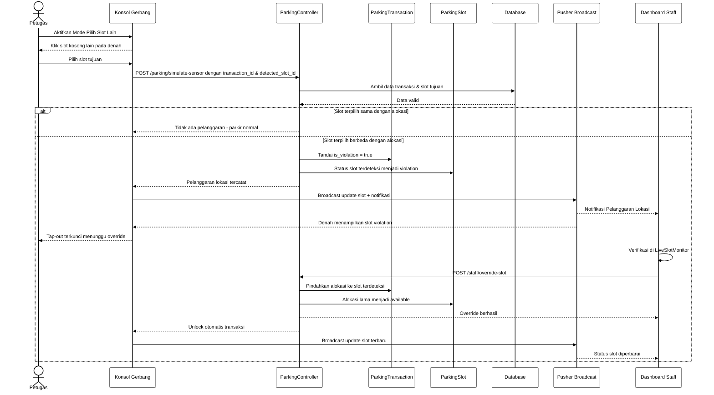

# Diagram UML — Smart Parking System

Kumpulan diagram *Activity* dan *Sequence* (format **Mermaid**) untuk skripsi.
Setiap blok dapat disalin langsung ke editor Mermaid (mermaid.live / VS Code) atau
dirender untuk dimasukkan ke dokumen. Semua diagram memakai gaya **hitam-putih**
(isi putih, garis & teks hitam) dan garis penghubung **lurus/patah** (orthogonal).

Hasil render tersedia di folder `dokumen/gambar/` dengan penamaan
`diagram-<no>-<tipe>-<judul>.svg` (vektor) dan `.png` (raster resolusi tinggi).

Daftar diagram:

- [1. Activity — Login & Autentikasi Role](#1-activity--login--autentikasi-role)
- [2. Activity — Transaksi Masuk (Tap-In)](#2-activity--transaksi-masuk-tap-in)
- [3. Activity — Transaksi Keluar (Tap-Out)](#3-activity--transaksi-keluar-tap-out)
- [4. Activity — Simulasi Pelanggaran & Override Slot](#4-activity--simulasi-pelanggaran--override-slot)
- [5. Sequence — Login & Autentikasi Role](#5-sequence--login--autentikasi-role)
- [6. Sequence — Transaksi Masuk & Keluar](#6-sequence--transaksi-masuk--keluar)
- [7. Sequence — Simulasi Pelanggaran & Override Slot](#7-sequence--simulasi-pelanggaran--override-slot)

---

## 1. Activity — Login & Autentikasi Role

Alur autentikasi pengguna berdasarkan peran (Admin / Staff / Customer) beserta
penerbitan token dan pengalihan ke dashboard masing-masing.

---

## 2. Activity — Transaksi Masuk (Tap-In)

Alur kendaraan masuk ke area parkir: identifikasi plat, pemilihan slot kosong
terbaik, hingga konfirmasi alokasi slot.

---

## 3. Activity — Transaksi Keluar (Tap-Out)

Alur kendaraan keluar: validasi transaksi aktif, pengecekan status pelanggaran,
penghitungan durasi & biaya, hingga penerbitan kuitansi.

> Alternatif: Customer dapat mengajukan permintaan tap-out manual
> (`request-manual-tapout`) yang kemudian diverifikasi oleh staff.

---

## 4. Activity — Simulasi Pelanggaran & Override Slot

Alur simulasi pelanggaran lokasi saat kendaraan parkir di luar alokasi, notifikasi
ke staff, penguncian tap-out, hingga unlock setelah override.

---

## 5. Sequence — Login & Autentikasi Role

Interaksi antarmuka portal, controller autentikasi, dan database untuk masuk
(login) dan keluar (logout) berdasarkan peran.

---

## 6. Sequence — Transaksi Masuk & Keluar

Interaksi petugas dengan konsol gerbang, controller, model transaksi & slot,
database, hingga sinkronisasi real-time ke dashboard staff.

---

## 7. Sequence — Simulasi Pelanggaran & Override Slot

Interaksi simulasi pelanggaran lokasi dari konsol gerbang, pencatatan violation,
pengiriman notifikasi ke staff, hingga proses override dan unlock otomatis.

